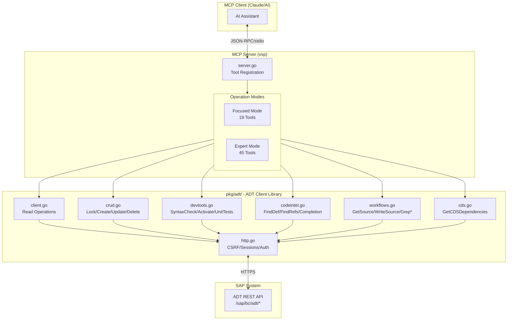
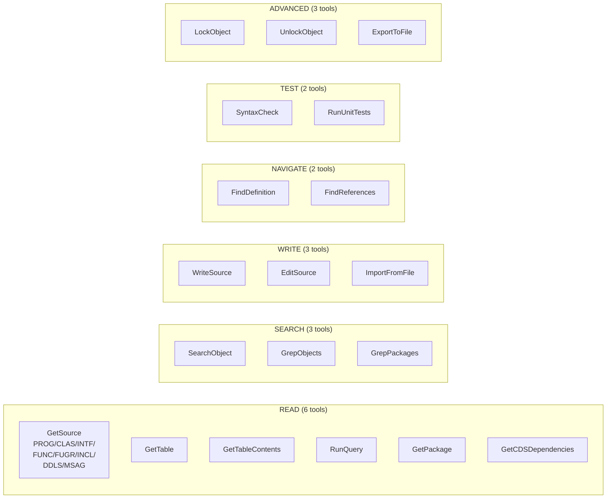
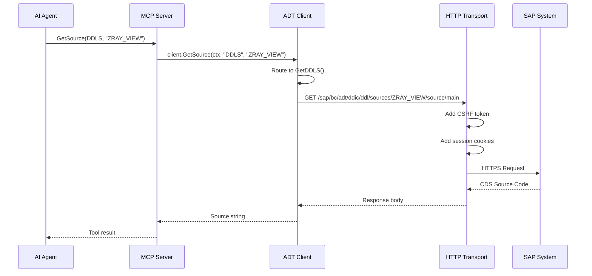
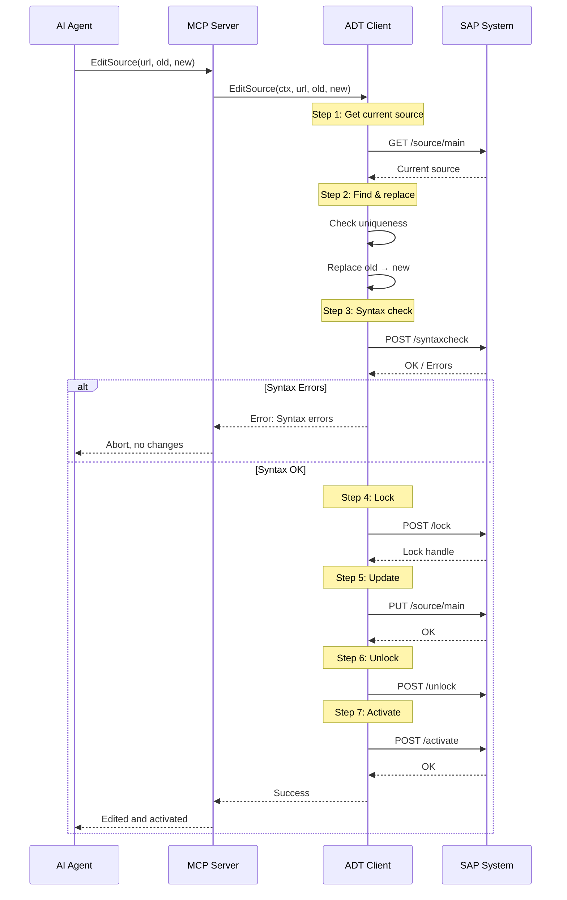
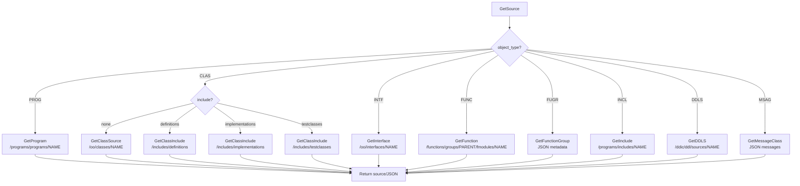

# vsp Architecture

This document describes the architecture of the Go-native MCP server for SAP ADT.

## High-Level Overview



## Tool Categories (Focused Mode)



## Data Flow: Read Operation



## Data Flow: Write Operation (EditSource)



## Object Type Routing (GetSource)



## ASCII Overview (for terminals without Mermaid)

```
┌─────────────────────────────────────────────────────────────────────────┐
│                           MCP Client (Claude)                          │
└─────────────────────────────────────────────────────────────────────────┘
                                    │
                              JSON-RPC/stdio
                                    │
                                    ▼
┌─────────────────────────────────────────────────────────────────────────┐
│                        internal/mcp/server.go                          │
│                Mode-Aware Tool Registration (45 total)                 │
│      ┌─────────────────────────────────────────────────────┐           │
│      │ Focused Mode (19 tools) - AI-Optimized              │           │
│      │ • Unified: GetSource, WriteSource                    │           │
│      │ • Enhanced Search: GrepObjects, GrepPackages         │           │
│      │ • File Ops: ImportFromFile, ExportToFile             │           │
│      │ • Core: EditSource, SearchObject, FindDef/Refs       │           │
│      │ • Data: GetTable, GetTableContents, RunQuery, CDS    │           │
│      │ • Dev: SyntaxCheck, RunUnitTests                     │           │
│      │ • Advanced: Lock/Unlock, GetPackage, GetFunctionGrp │           │
│      └─────────────────────────────────────────────────────┘           │
│      ┌─────────────────────────────────────────────────────┐           │
│      │ Expert Mode (45 tools) - Complete + Legacy          │           │
│      │ All focused tools + atomic operations + granular I/O│           │
│      └─────────────────────────────────────────────────────┘           │
└─────────────────────────────────────────────────────────────────────────┘
                                    │
                            pkg/adt.Client
                                    │
                                    ▼
┌─────────────────────────────────────────────────────────────────────────┐
│                            pkg/adt/                                     │
│                                                                         │
│  ┌──────────────────────────────────────────────────────────────────┐  │
│  │ client.go - Main Client Facade                                    │  │
│  │   • NewClient(opts...)                                           │  │
│  │   • Read operations: SearchObject, GetProgram, GetClass, etc.    │  │
│  └──────────────────────────────────────────────────────────────────┘  │
│                                                                         │
│  ┌────────────────┐ ┌────────────────┐ ┌────────────────────────────┐  │
│  │ crud.go        │ │ devtools.go    │ │ codeintel.go               │  │
│  │ • LockObject   │ │ • SyntaxCheck  │ │ • FindDefinition           │  │
│  │ • UnlockObject │ │ • Activate     │ │ • FindReferences           │  │
│  │ • UpdateSource │ │ • RunUnitTests │ │ • CodeCompletion           │  │
│  │ • CreateObject │ └────────────────┘ │ • PrettyPrint              │  │
│  │ • DeleteObject │                    │ • GetPrettyPrinterSettings │  │
│  │ • GetClassIncl │ ┌────────────────┐ │ • SetPrettyPrinterSettings │  │
│  │ • CreateTestI. │ │ workflows.go   │ │ • GetTypeHierarchy         │  │
│  │ • UpdateClassI.│ │ • WriteProgram │ └────────────────────────────┘  │
│  └────────────────┘ │ • WriteClass   │                                  │
│                     │ • CreateAndAct.│  ┌────────────────┐             │
│                     │ • CreateClass..│  │ config.go      │             │
│                     │ • GetSource    │  │ • FromEnv()    │             │
│                     │ • WriteSource  │  │ • Options      │             │
│                     │ • GrepObjects  │  │ • Mode         │             │
│                     │ • GrepPackages │  └────────────────┘             │
│                     └────────────────┘                                  │
│                                                                         │
│  ┌──────────────────────────────────┐                                  │
│  │ http.go - HTTP Transport         │                                  │
│  │   • CSRF token management        │  ┌────────────────┐             │
│  │   • Session cookies              │  │ xml.go         │             │
│  │   • Stateful sessions            │  │ • ADT XML types│             │
│  │   • Basic authentication         │  │ • Parsing      │             │
│  └──────────────────────────────────┘  └────────────────┘             │
└─────────────────────────────────────────────────────────────────────────┘
                                    │
                              HTTPS/HTTP
                                    │
                                    ▼
┌─────────────────────────────────────────────────────────────────────────┐
│                        SAP ABAP Development Tools                       │
│                            (ADT REST API)                               │
└─────────────────────────────────────────────────────────────────────────┘
```

## Directory Structure

```
vibing-steampunk/
├── cmd/vsp/
│   └── main.go                  # CLI entry point (cobra/viper), auth handling
│
├── internal/mcp/
│   ├── server.go                # MCP server implementation (45 tool handlers, mode-aware)
│   └── server_test.go           # Server unit tests
│
├── pkg/adt/
│   ├── client.go                # ADT client facade + read operations
│   ├── client_test.go           # Client unit tests with mocks
│   ├── config.go                # Configuration with functional options
│   ├── config_test.go           # Config unit tests
│   ├── cookies.go               # Cookie file parsing (Netscape format)
│   ├── cookies_test.go          # Cookie parsing unit tests
│   ├── http.go                  # HTTP transport (CSRF, sessions, auth)
│   ├── http_test.go             # Transport unit tests
│   ├── crud.go                  # CRUD operations (lock, create, update, delete)
│   ├── devtools.go              # Dev tools (syntax check, activate, unit tests)
│   ├── codeintel.go             # Code intelligence (find def, refs, completion)
│   ├── workflows.go             # High-level workflow operations
│   ├── xml.go                   # XML types and parsing
│   ├── xml_test.go              # XML parsing tests
│   └── integration_test.go      # Integration tests (requires SAP system)
│
├── reports/                     # Project documentation and research
│   ├── vsp-status.md     # Implementation status
│   ├── cookie-auth-implementation-guide.md  # Cookie auth research
│   └── *.md                     # Discovery and analysis documents
│
├── build/                       # Cross-platform binaries (9 targets)
├── Makefile                     # Build automation
└── .gitignore                   # Excludes .env, cookies.txt, .mcp.json
```

## Component Details

### cmd/vsp/main.go

Entry point for the MCP server with full CLI support:
- **cobra** for command-line argument parsing
- **viper** for environment variable binding
- **godotenv** for .env file loading
- Configuration priority: CLI flags > env vars > .env > defaults
- Authentication: Basic auth or cookie-based (mutually exclusive)
- Starts MCP server on stdio

### internal/mcp/server.go

MCP protocol implementation:
- Registers 19 tools (focused mode, default) or 45 tools (expert mode) with the MCP SDK
- Maps tool calls to ADT client methods
- Handles JSON-RPC communication

### pkg/adt/ - ADT Client Library

#### client.go
Main client facade providing read operations:
- `SearchObject` - Quick search for ABAP objects
- `GetProgram`, `GetClass`, `GetInterface`, `GetInclude`
- `GetFunction`, `GetFunctionGroup`
- `GetTable`, `GetTableContents`, `GetStructure`
- `GetPackage`, `GetTransaction`, `GetTypeInfo`
- `RunQuery` - Freestyle SQL queries

#### http.go
HTTP transport layer:
- Automatic CSRF token fetching and refresh
- Session cookie management
- Stateful session support (required for CRUD)
- Basic authentication (username/password)
- Cookie authentication (from file or string)
- TLS configuration with optional skip-verify

#### cookies.go
Cookie authentication support:
- `LoadCookiesFromFile` - Netscape-format cookie file parsing
- `ParseCookieString` - Cookie header string parsing
- Supports SAP session cookies (MYSAPSSO2, SAP_SESSIONID, sap-usercontext)

#### crud.go
Object modification operations:
- `LockObject` / `UnlockObject` - Edit locks
- `CreateObject` - Create programs, classes, interfaces, includes, function groups, function modules
- `UpdateSource` - Write source code
- `DeleteObject` - Remove objects
- `GetClassInclude` / `CreateTestInclude` / `UpdateClassInclude` - Class include operations

#### devtools.go
Development tools:
- `SyntaxCheck` - Check ABAP source for errors
- `Activate` - Activate objects
- `RunUnitTests` - Execute ABAP Unit tests

#### codeintel.go
Code intelligence features:
- `FindDefinition` - Navigate to symbol definition
- `FindReferences` - Find all usages
- `CodeCompletion` / `CodeCompletionFull` - Code suggestions
- `PrettyPrint` - Format source code
- `GetPrettyPrinterSettings` / `SetPrettyPrinterSettings` - Formatter config
- `GetTypeHierarchy` - Type hierarchy (supertypes/subtypes)

#### workflows.go
High-level operations combining multiple steps:
- `WriteProgram` - Lock → Check → Update → Unlock → Activate
- `WriteClass` - Lock → Check → Update → Unlock → Activate
- `CreateAndActivateProgram` - Create → Update → Activate
- `CreateClassWithTests` - Create class → Create tests → Update → Activate → Run tests

#### config.go
Configuration management:
- `FromEnv()` - Load config from environment
- Functional options pattern for customization

#### xml.go
ADT XML types and parsing utilities for request/response handling.

## Data Flow

### Read Operation Example (GetProgram)

```
1. MCP Client calls "GetProgram" tool with name parameter
2. server.go handler receives call
3. Handler calls client.GetProgram(ctx, name)
4. client.go fetches from /sap/bc/adt/programs/programs/{name}/source/main
5. http.go handles CSRF token, authentication, session
6. Response parsed and returned as tool result
```

### Write Operation Example (WriteProgram)

```
1. MCP Client calls "WriteProgram" with name and source
2. server.go handler receives call
3. Handler calls client.WriteProgram(ctx, name, source)
4. workflows.go orchestrates:
   a. LockObject(name) - Acquire lock
   b. SyntaxCheck(source) - Validate code
   c. UpdateSource(name, source) - Write code
   d. UnlockObject(name) - Release lock
   e. Activate(name) - Activate object
5. Result returned with success/error status
```

## Testing

### Unit Tests (154 tests)

**Mock-based testing** - No SAP system required
- Mock HTTP transport intercepts network calls
- Predefined responses simulate SAP behavior
- Fast execution: ~0.02s total
- Run with: `go test ./...`
- All tests run in CI/CD

**Test files:**
```
pkg/adt/
├── client_test.go         # Read operations (SearchObject, Get*)
├── workflows_test.go      # Unified tools (GetSource, WriteSource, Grep*)
├── http_test.go           # HTTP transport (CSRF, sessions, cookies)
├── cookies_test.go        # Cookie file parsing (Netscape format)
├── fileparser_test.go     # ABAP file type detection
├── xml_test.go            # XML parsing (ADT responses)
├── config_test.go         # Configuration options
└── safety_test.go         # Safety checks (read-only, SQL blocking)
internal/mcp/server_test.go # MCP server
```

**What's tested:**
- ✅ URL construction for all object types
- ✅ Request parameter handling
- ✅ Response parsing (XML, JSON)
- ✅ Error handling and validation
- ✅ Type dispatching (PROG vs CLAS vs FUNC)
- ✅ Unified tool logic (GetSource, WriteSource, GrepObjects, GrepPackages)
- ✅ Option handling (include types, parent names, modes)

**What's NOT tested (requires integration tests):**
- ❌ Real network communication
- ❌ Actual SAP system behavior
- ❌ Authentication handshake
- ❌ CSRF token refresh
- ❌ Lock conflicts
- ❌ Activation errors

### Mock HTTP Transport

Unit tests use `mockTransportClient` / `mockWorkflowTransport` to replace real HTTP:

```go
// Mock replaces real HTTP client
mock := &mockWorkflowTransport{
    responses: map[string]*http.Response{
        "/sap/bc/adt/programs/programs/ZTEST/source/main":
            // Fake response with ABAP source code
            newTestResponse(`REPORT ztest.\nWRITE: 'Hello'.`),
    },
}

// Inject mock into client
transport := NewTransportWithClient(cfg, mock)
client := NewClientWithTransport(cfg, transport)

// Test runs without network calls
result, err := client.GetSource(ctx, "PROG", "ZTEST", &GetSourceOptions{})
```

**Benefits:**
- Tests run on any machine (no SAP needed)
- Reliable (no network flakiness)
- Fast (milliseconds vs seconds)
- Deterministic (same results every time)
- CI/CD friendly (no external dependencies)

### Integration Tests (21+ tests)

**Real SAP system testing** - Full end-to-end verification
- `integration_test.go` with build tag: `integration`
- Run with: `go test -tags=integration ./pkg/adt/`
- Requires: `SAP_URL`, `SAP_USER`, `SAP_PASSWORD`, `SAP_CLIENT`
- Creates temporary objects in `$TMP` package, cleans up after
- Tests: Authentication, CSRF, locking, activation, unit test execution

**What's tested:**
- ✅ Complete CRUD workflows (Create → Lock → Update → Unlock → Activate)
- ✅ Real XML/JSON parsing from actual SAP responses
- ✅ Authentication and session management
- ✅ CSRF token handling
- ✅ Lock acquisition and release
- ✅ Syntax check and activation
- ✅ ABAP Unit test execution
- ✅ Package creation and deletion

## Design Decisions

1. **Single Binary**: No runtime dependencies for easy distribution
2. **Functional Options**: Flexible client configuration
3. **Stateful HTTP**: Required for CRUD operations with locks
4. **Workflow Tools**: Reduce round-trips for common operations
5. **Separation of Concerns**: Clean split between MCP, client, and transport layers
6. **CLI Framework**: cobra/viper for professional CLI experience
7. **Dual Auth**: Support both basic auth and cookie auth for SSO scenarios

## Build Targets

The Makefile supports cross-compilation to 9 platform targets:

| OS | Architectures |
|----|---------------|
| Linux | amd64, arm64, 386, arm |
| macOS | amd64, arm64 (Apple Silicon) |
| Windows | amd64, arm64, 386 |

Build commands:
- `make build` - Current platform
- `make build-all` - All 9 targets
- `make build-linux` / `make build-darwin` / `make build-windows` - OS-specific
