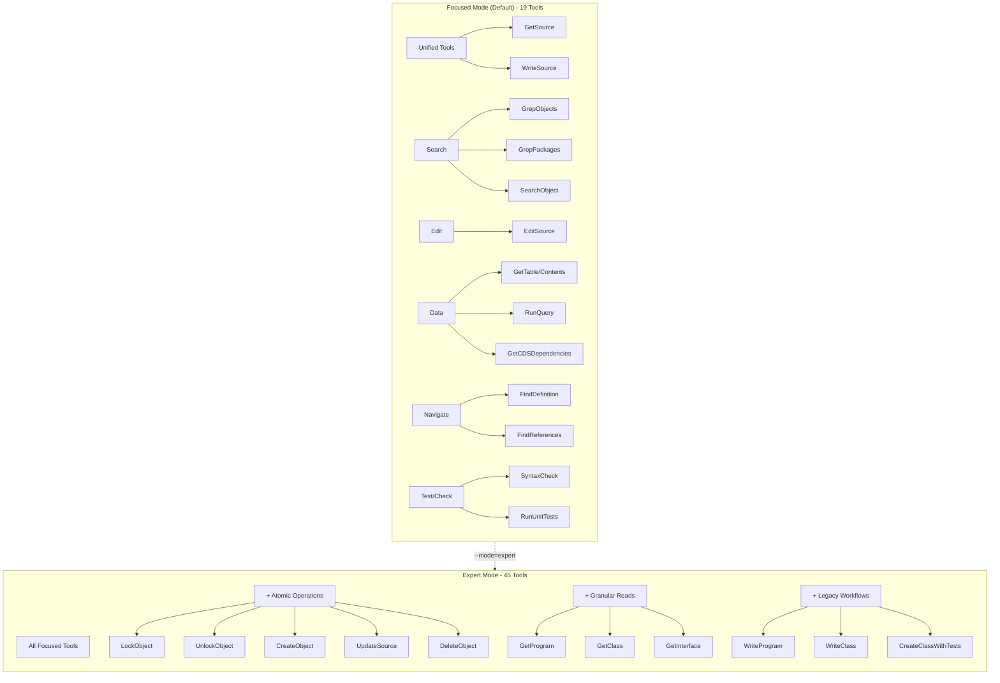
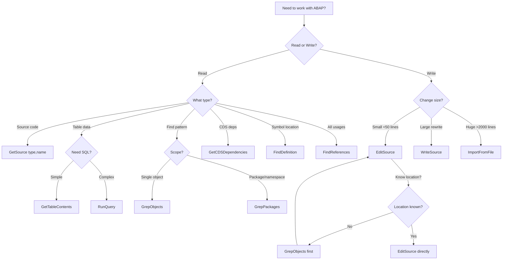
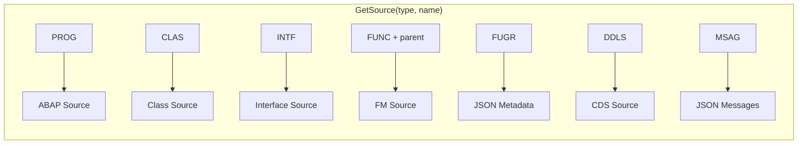
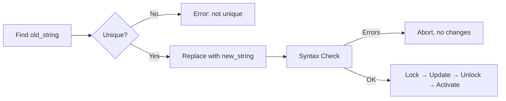
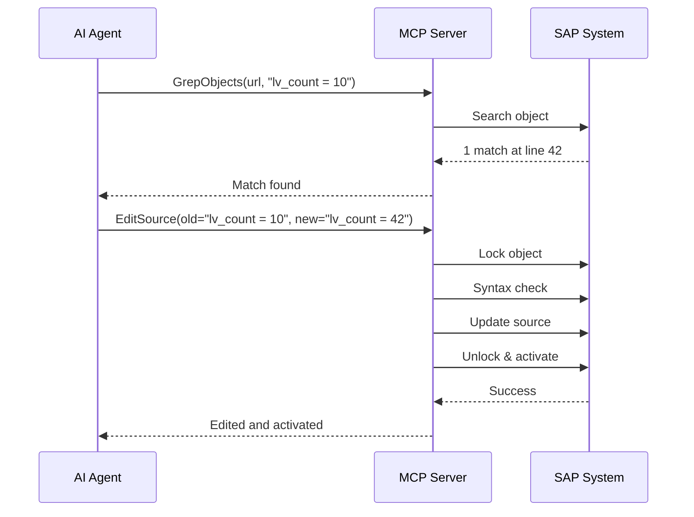
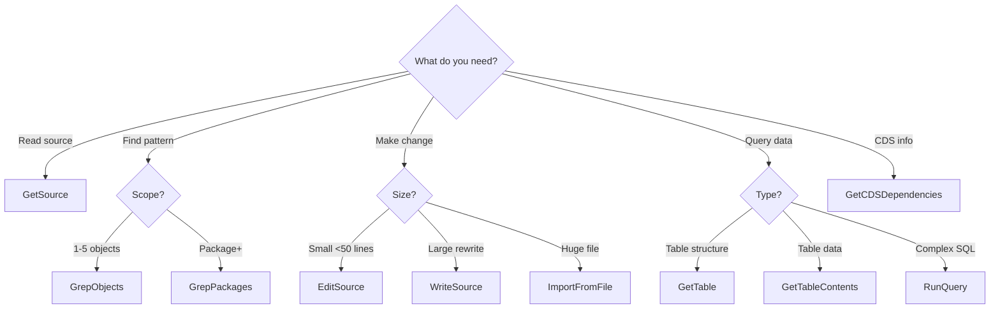

# MCP Usage Guide for AI Agents

**Target Audience:** AI assistants (Claude, GPT, etc.) using this MCP server for ABAP development.

**Purpose:** Machine-friendly reference for optimal tool usage patterns, workflows, and best practices.

---

## Critical Limitations (Read First!)

### SQL Query Limitations (RunQuery / GetTableContents)

The SAP ADT Data Preview API uses **ABAP SQL syntax**, NOT standard SQL:

| Feature | Status | Syntax |
|---------|--------|--------|
| `ORDER BY col` | **Works** | `ORDER BY field_name` |
| `ORDER BY col ASCENDING` | **Works** | ABAP keyword |
| `ORDER BY col DESCENDING` | **Works** | ABAP keyword |
| `ORDER BY col ASC` | **FAILS** | SQL standard - not supported |
| `ORDER BY col DESC` | **FAILS** | SQL standard - not supported |
| `LIMIT n` | **FAILS** | Use `max_rows` parameter instead |
| `GROUP BY` | **Works** | `GROUP BY field_name` |
| `COUNT(*)` | **Works** | Aggregate functions work |
| `WHERE` | **Works** | Standard conditions |

**Correct Example:**
```sql
SELECT carrid, COUNT(*) as cnt FROM sflight GROUP BY carrid ORDER BY cnt DESCENDING
```

**Wrong Example (will fail):**
```sql
SELECT carrid, COUNT(*) as cnt FROM sflight GROUP BY carrid ORDER BY cnt DESC
```

### Object Type Coverage

| Object Type | GetSource | WriteSource | Notes |
|-------------|:---------:|:-----------:|-------|
| PROG (Program) | **Y** | **Y** | Full support |
| CLAS (Class) | **Y** | **Y** | Includes: definitions, implementations, testclasses |
| INTF (Interface) | **Y** | **Y** | Full support |
| FUNC (Function Module) | **Y** | N | Requires `parent` (function group) |
| FUGR (Function Group) | **Y** | N | Returns JSON metadata |
| INCL (Include) | **Y** | N | Read-only |
| DDLS (CDS DDL Source) | **Y** | N | CDS view definitions |
| MSAG (Message Class) | **Y** | N | Returns JSON with all messages |

### CDS Dependencies

`GetCDSDependencies` returns the **base table/view dependencies** of a CDS view:
- Tables the view reads from
- Other CDS views used in FROM clause
- Does NOT return reverse dependencies (where-used)

---

## Server Modes



### Mode Selection Guide

| Use Case | Mode | Reason |
|----------|------|--------|
| Standard development | Focused | Simpler, fewer choices |
| Existing workflow scripts | Expert | Backward compatibility |
| Debugging lock issues | Expert | Direct LockObject access |
| Learning the API | Expert | See all atomic operations |

---

## Tool Selection Decision Tree



---

## Quick Reference

### Reading Objects



| Task | Tool | Parameters | Returns |
|------|------|------------|---------|
| Read program | `GetSource` | `type=PROG, name=ZTEST` | ABAP source |
| Read class | `GetSource` | `type=CLAS, name=ZCL_TEST` | Class source |
| Read class definitions | `GetSource` | `type=CLAS, name=ZCL_TEST, include=definitions` | Definitions include |
| Read class tests | `GetSource` | `type=CLAS, name=ZCL_TEST, include=testclasses` | Test classes |
| Read interface | `GetSource` | `type=INTF, name=ZIF_TEST` | Interface source |
| Read function module | `GetSource` | `type=FUNC, name=Z_FM, parent=ZFUGR` | FM source |
| Read function group structure | `GetSource` | `type=FUGR, name=ZFUGR` | JSON (FM list) |
| Read CDS view | `GetSource` | `type=DDLS, name=ZDDL_VIEW` | CDS source |
| Read message class | `GetSource` | `type=MSAG, name=ZMSAG` | JSON (all messages) |

### Writing Objects

| Task | Tool | Notes |
|------|------|-------|
| Small edit (<50 lines) | `EditSource` | Surgical replacement, syntax checked |
| Full rewrite | `WriteSource` | Auto-detects create vs update |
| Create new | `WriteSource(mode=create)` | Explicit create |
| Update existing | `WriteSource(mode=update)` | Explicit update |
| Deploy large file | `ImportFromFile` | Bypasses token limits |

### Searching

| Task | Tool | Parameters |
|------|------|------------|
| Find in single object | `GrepObjects` | `object_urls=[url], pattern=regex` |
| Find in multiple objects | `GrepObjects` | `object_urls=[url1, url2, ...], pattern=regex` |
| Find in package | `GrepPackages` | `packages=[PKG], pattern=regex` |
| Find in namespace | `GrepPackages` | `packages=[Z*], include_subpackages=true` |
| Find object by name | `SearchObject` | `query=Z*TEST*` |

---

## Tool Catalog (Focused Mode)

### GetSource - Unified Read Tool

**Purpose:** Read any ABAP object source code with a single tool.

**Parameters:**
| Parameter | Required | Values | Description |
|-----------|----------|--------|-------------|
| `object_type` | Yes | PROG, CLAS, INTF, FUNC, FUGR, INCL, DDLS, MSAG | Object type |
| `name` | Yes | string | Object name (uppercase) |
| `parent` | FUNC only | string | Function group name |
| `include` | CLAS only | definitions, implementations, macros, testclasses | Class include type |

**Examples:**

```json
// Read program
{ "object_type": "PROG", "name": "ZTEST" }

// Read class with test include
{ "object_type": "CLAS", "name": "ZCL_TEST", "include": "testclasses" }

// Read function module
{ "object_type": "FUNC", "name": "Z_MY_FM", "parent": "Z_MY_FG" }

// Read CDS view source
{ "object_type": "DDLS", "name": "ZRAY_00_I_DOC_NODE_00" }

// Read all messages in message class
{ "object_type": "MSAG", "name": "ZRAY_00" }
```

### EditSource - Surgical Edit

**Purpose:** Make small, precise changes with automatic syntax checking.

**Workflow:**


**Parameters:**
| Parameter | Required | Description |
|-----------|----------|-------------|
| `object_url` | Yes | ADT URL (e.g., `/sap/bc/adt/programs/programs/ZTEST`) |
| `old_string` | Yes | Exact string to find and replace |
| `new_string` | Yes | Replacement string |
| `replace_all` | No | Replace all occurrences (default: false) |
| `syntax_check` | No | Validate before saving (default: true) |
| `case_insensitive` | No | Case-insensitive matching (default: false) |

**Best Practice:** Include context for uniqueness:
```json
{
  "old_string": "METHOD calculate.\n    rv_result = 0.\n  ENDMETHOD.",
  "new_string": "METHOD calculate.\n    rv_result = iv_a + iv_b.\n  ENDMETHOD."
}
```

### GrepObjects / GrepPackages - Pattern Search

**Purpose:** Find patterns before editing, audit code, prepare refactoring.

**Regex Syntax:** Go regexp (NOT PCRE)
- `\w+` - word characters
- `\s+` - whitespace
- `(?i)` - case insensitive flag
- NO lookahead/lookbehind

**Common ABAP Patterns:**
```regex
TODO|FIXME                    # Find TODO comments
lv_\w+                        # Local variables
gv_\w+                        # Global variables
SELECT.*FROM\s+(\w+)          # SELECT statements
CALL FUNCTION\s+'(\w+)'       # Function calls
AUTHORITY-CHECK               # Auth checks
(?i)password|pwd|secret       # Credentials (case-insensitive)
```

### RunQuery - SQL Execution

**Purpose:** Execute freestyle SQL against SAP database.

**IMPORTANT:** Use ABAP SQL syntax!

**Working Examples:**
```sql
-- Simple query
SELECT * FROM t000

-- With filter
SELECT * FROM sflight WHERE carrid = 'LH'

-- With aggregation (ASCENDING/DESCENDING, not ASC/DESC!)
SELECT carrid, COUNT(*) as cnt FROM sflight GROUP BY carrid ORDER BY cnt DESCENDING

-- Use max_rows parameter for limiting, NOT LIMIT keyword
```

**Parameters:**
| Parameter | Required | Description |
|-----------|----------|-------------|
| `sql_query` | Yes | ABAP SQL query |
| `max_rows` | No | Row limit (default: 100) |

### GetCDSDependencies - CDS Analysis

**Purpose:** Get the dependency tree of a CDS view.

**Returns:** Tables and views that the CDS view depends on (forward dependencies).

```json
{
  "ddls_name": "ZRAY_00_I_DOC_NODE_00"
}
// Returns:
{
  "name": "ZRAY_00_I_DOC_NODE_00",
  "type": "CDS_VIEW",
  "children": [
    { "name": "ZLLM_00_NODE", "type": "TABLE", "relation": "FROM" },
    { "name": "ZRAY_00_DOC", "type": "TABLE", "relation": "FROM" }
  ]
}
```

---

## Common Workflows

### 1. Find and Replace Pattern



### 2. Read CDS View and Dependencies

```
Step 1: GetSource(type=DDLS, name=ZRAY_00_I_DOC_NODE_00)
        → Returns CDS source code

Step 2: GetCDSDependencies(ddls_name=ZRAY_00_I_DOC_NODE_00)
        → Returns: ZLLM_00_NODE (TABLE), ZRAY_00_DOC (TABLE)

Step 3: GetTable(table_name=ZLLM_00_NODE)
        → Returns table structure
```

### 3. Package-Wide Refactoring

```
Step 1: GrepPackages(packages=["ZPACKAGE"], pattern="CALL FUNCTION 'OLD_FM'")
        → Returns: 3 objects with matches

Step 2: For each object:
        EditSource(
          object_url=obj.objectUrl,
          old_string="CALL FUNCTION 'OLD_FM'",
          new_string="CALL FUNCTION 'NEW_FM'",
          replace_all=true
        )
```

### 4. Understand Error Messages

```
Step 1: GetSource(type=MSAG, name=ZRAY_00)
        → Returns JSON with all messages:
        {
          "messages": [
            {"number": "001", "text": "Include & is empty"},
            {"number": "002", "text": "Object &1 : &2 not found"}
          ]
        }
```

---

## Error Handling

### EditSource Errors

| Error | Cause | Solution |
|-------|-------|----------|
| "matches 3 locations (not unique)" | old_string found multiple times | Add more context or use `replace_all=true` |
| "syntax errors" | New code has errors | Fix syntax, check is atomic (no changes made) |
| "old_string not found" | Exact match not found | Check whitespace, case, use GrepObjects first |
| "object locked" | Someone else has lock | Wait or contact lock owner |

### RunQuery Errors

| Error | Cause | Solution |
|-------|-------|----------|
| `"DESC" is not allowed` | Used SQL `DESC` | Use `DESCENDING` instead |
| `"ASC" is not allowed` | Used SQL `ASC` | Use `ASCENDING` instead |
| `LIMIT not recognized` | Used SQL `LIMIT` | Use `max_rows` parameter |

### GetCDSDependencies Errors

| Error | Cause | Solution |
|-------|-------|----------|
| 404 Not Found | CDS view doesn't exist | Check name with SearchObject first |
| Empty children | View has no dependencies | View selects from parameter or is empty |

---

## Performance Tips

### Token Optimization

| Operation | Tokens | Better Alternative |
|-----------|--------|-------------------|
| GetSource (500 lines) | ~2,500 | GrepObjects (targeted) ~100 |
| WriteSource (full rewrite) | ~5,000 | EditSource (surgical) ~100 |
| Multiple GetProgram calls | ~10,000 | Single GrepPackages ~500 |

### Search Strategy

1. **Start narrow:** GrepObjects on known object first
2. **Expand if needed:** GrepPackages for package-wide
3. **Use filters:** Object type filters reduce noise
4. **Limit results:** max_results prevents overwhelming responses

---

## Summary: When to Use What



---

**Last Updated:** 2025-12-04
**MCP Server Version:** v2.2.0+
**Maintained by:** vibing-steampunk project
